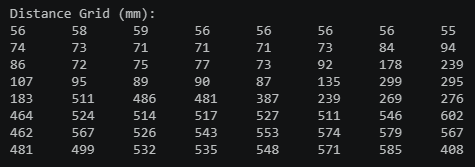
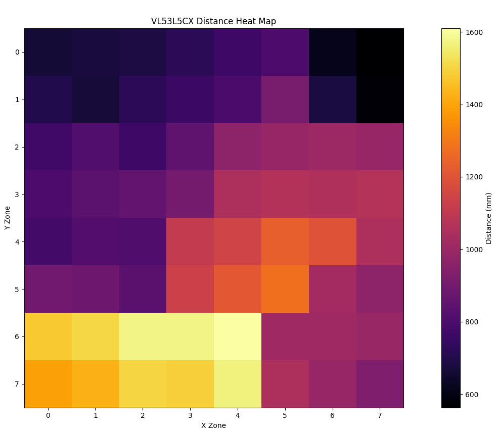

# ToF Sensor Bring-Up Guide

This guide explains how to wire the VL53L5CX ToF sensor to the Raspberry Pi Pico, load the ToF bring-up firmware, and view the live 8x8 distance heat map.

## Wiring

This setup powers the sensor from the Pico 5 V output and keeps the I2C bus pulled up to 3.3 V.

| Connection | Pico Pin | Sensor / Bus Connection |
| --- | --- | --- |
| 5 V power | VBUS / 5 V output, physical pin 40 | Sensor VIN |
| Ground | Any Pico GND | Sensor GND |
| I2C SDA | GP0, physical pin 1 | Sensor SDA |
| I2C SCL | GP1, physical pin 2 | Sensor SCL |
| SDA pull-up | 3V3 rail | 4.7 kOhm resistor from SDA to 3V3 |
| SCL pull-up | 3V3 rail | 4.7 kOhm resistor from SCL to 3V3 |

Text wiring diagram:

```text
Raspberry Pi Pico                         VL53L5CX Sensor
-----------------                         ----------------
VBUS / 5V  pin 40  ---------------------> VIN
GND        any GND ---------------------> GND
GP0 / SDA  pin 1   ---------------------> SDA
GP1 / SCL  pin 2   ---------------------> SCL

3V3 rail  -------- 4.7 kOhm resistor ----> SDA line
3V3 rail  -------- 4.7 kOhm resistor ----> SCL line
```

Important: VIN gets 5 V, but SDA and SCL must be pulled up to 3.3 V, not 5 V. The Pico GPIO pins are 3.3 V logic pins.

## Files Created For This Bring-Up

All ToF-specific files are in:

```text
Bringup/
  ToF/
    main_ToF.cpp
    RoverSensor.cpp
    RoverSensor.h
    serial_heatmap.py
    run_heatmap.py
    run_heatmap.bat
    requirements.txt
```

There is also a root shortcut:

```text
run_heatmap.py
```

## What Each File Does

`Bringup/ToF/main_ToF.cpp`

The Pico firmware entry point for this ToF test. It starts Serial at `115200`, waits briefly for USB Serial to settle, initializes the sensor, then repeatedly asks for new sensor data.

`Bringup/ToF/RoverSensor.h`

The small header that lets `main_ToF.cpp` call the sensor functions without needing to know the SparkFun library details.

`Bringup/ToF/RoverSensor.cpp`

The sensor driver layer for this bring-up. It owns the VL53L5CX object, starts I2C, initializes the sensor, sets 8x8 resolution, sets 10 Hz ranging, and prints each distance frame to Serial.

The Python script expects the Serial output to look like this:

```text
Distance Grid (mm):
123     125     130     ...
...
-----------------------
```

`Bringup/ToF/serial_heatmap.py`

The computer-side viewer. It opens the Pico COM port, waits for `Distance Grid (mm):`, reads the next 8 rows, converts the numbers into an 8x8 array, and updates a Matplotlib heat map.

`Bringup/ToF/run_heatmap.py`

The local launcher for the heat map. It uses the project `.venv` when available, installs the Python requirements, and starts `serial_heatmap.py`.

`Bringup/ToF/run_heatmap.bat`

Windows batch wrapper for the same launcher.

`Bringup/ToF/requirements.txt`

Python dependencies for the heat map:

```text
matplotlib
numpy
pyserial
```

Root `run_heatmap.py`

A convenience wrapper so this works from the project root:

```powershell
python run_heatmap.py --port COM3
```

It forwards the command to `Bringup/ToF/run_heatmap.py`.

## How The Files Connect

```text
main_ToF.cpp
   calls
RoverSensor.h declarations
   implemented by
RoverSensor.cpp
   prints 8x8 distance grid over USB Serial
   read by
serial_heatmap.py
   launched by
run_heatmap.py
   displays
live heat map
```

## Example Output

The firmware prints each VL53L5CX frame as an 8x8 distance grid in the serial monitor:



The Python heat map script reads that same serial output and displays it as a live distance heat map:



## Full Timeline

1. Place the Pico and VL53L5CX sensor on the bench with power disconnected.

2. Connect Pico VBUS / 5 V output, physical pin 40, to the sensor VIN pin.

3. Connect a Pico GND pin to the sensor GND pin.

4. Connect Pico GP0, physical pin 1, to sensor SDA.

5. Connect Pico GP1, physical pin 2, to sensor SCL.

6. Add a 4.7 kOhm pull-up resistor from the SDA line to the Pico 3V3 rail.

7. Add a 4.7 kOhm pull-up resistor from the SCL line to the Pico 3V3 rail.

8. Recheck the power rails before plugging in USB:
   - Sensor VIN goes to Pico 5 V / VBUS.
   - Sensor GND goes to Pico GND.
   - SDA and SCL pull up to 3.3 V.
   - SDA and SCL do not pull up to 5 V.

9. Plug the Pico into the computer over USB.

10. Confirm the ToF firmware files are in `Bringup/ToF`.

11. Build the firmware from the project root:

```powershell
& "$env:USERPROFILE\.platformio\penv\Scripts\platformio.exe" run
```

12. Upload the firmware to the Pico:

```powershell
& "$env:USERPROFILE\.platformio\penv\Scripts\platformio.exe" run --target upload
```

13. Find the Pico serial port:

```powershell
.\.venv\Scripts\python.exe -m serial.tools.list_ports
```

14. Note the COM port, for example `COM3`.

15. Close any serial monitor that may already be using the Pico port.

16. Start the heat map from the project root:

```powershell
.\.venv\Scripts\python.exe run_heatmap.py --port COM3
```

17. Wait for the heat-map window to open. The launcher installs missing Python packages, then starts the serial reader.

18. Move an object in front of the VL53L5CX. The 8x8 heat map should update as the measured distances change.

## Debug Notes

If the sensor prints `Sensor failed!`, check wiring in this order:

1. VIN is connected to Pico 5 V / VBUS.
2. GND is shared between Pico and sensor.
3. SDA is on GP0.
4. SCL is on GP1.
5. SDA has a 4.7 kOhm pull-up to 3.3 V.
6. SCL has a 4.7 kOhm pull-up to 3.3 V.

If Python says the COM port access is denied:

1. Close PlatformIO Serial Monitor.
2. Close Arduino Serial Monitor or Serial Plotter.
3. Close any other running heat-map script.
4. Unplug and replug the Pico.
5. Run the heat-map command again.

If `pio` is not recognized, use the full PlatformIO path shown in the build and upload commands above.

If PowerShell blocks virtual environment activation, skip activation and run through `.venv\Scripts\python.exe` directly, as shown in the timeline.
