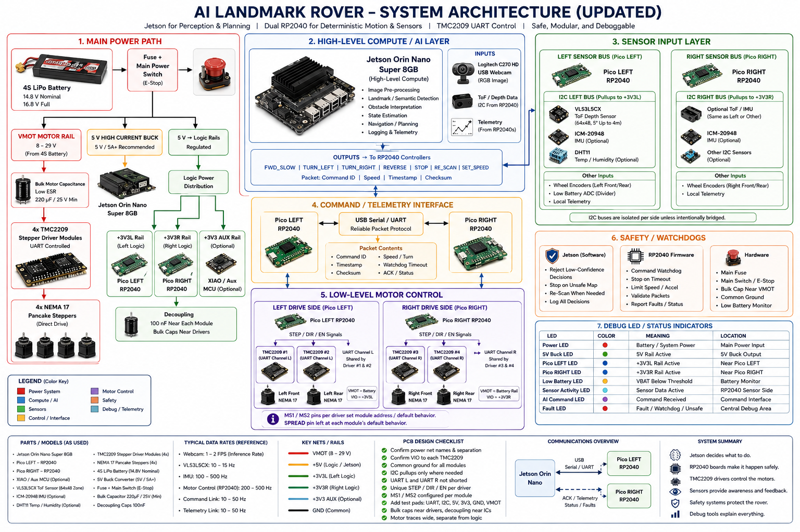

# ROAMER PlatformIO Firmware

This directory is the PlatformIO workspace for ROAMER's Raspberry Pi Pico bring-up firmware. Each hardware subsystem lives in its own folder under `Bringup/`, and `platformio.ini` selects exactly one subsystem at build time with `build_src_filter`.

The firmware sits in the low-level control layer of the broader rover architecture:



The current environments target the Raspberry Pi Pico using the Arduino framework:

| Environment | Source Folder | Purpose |
| --- | --- | --- |
| `pico_tof` | `Bringup/ToF/` | VL53L5CX 8x8 time-of-flight distance grid and serial heat-map workflow. |
| `pico_dht11` | `Bringup/DHT11/` | DHT11 temperature and humidity serial output. |
| `pico_tmc2209` | `Bringup/TMC2209/` | TMC2209 STEP/DIR NEMA 17 stepper motor bring-up. |

## PlatformIO Layout

```text
Rover/
  platformio.ini              PlatformIO environments, board settings, libraries, and source filters
  run_heatmap.py              Root shortcut for the ToF heat-map launcher
  Bringup/
    ToF/
      main_ToF.cpp            Pico entry point for the VL53L5CX bring-up
      RoverSensor.cpp         VL53L5CX setup, ranging loop, and serial frame output
      RoverSensor.h           ToF helper declarations
      serial_heatmap.py       Host-side serial parser and Matplotlib heat-map viewer
      run_heatmap.py          ToF launcher that installs requirements and starts the viewer
      run_heatmap.bat         Windows wrapper for the ToF launcher
      requirements.txt        Python packages for the ToF viewer
      images/                 README screenshots for ToF output
      README.md               ToF wiring, setup, and debug guide
    DHT11/
      main_temp_humid.cpp     Pico entry point for the DHT11 bring-up
      TempHumidSensor.cpp     DHT11 setup, reads, validation, and serial printing
      TempHumidSensor.h       DHT11 helper declarations
      images/                 README screenshot for DHT11 output
      README.md               DHT11 wiring and firmware guide
    TMC2209/
      main_tmc2209.cpp        Pico entry point for the stepper bring-up
      StepperMotor.cpp        GPIO setup, enable control, direction changes, and step pulses
      StepperMotor.h          Stepper helper declarations
      README.md               TMC2209 wiring, power, and firmware guide
  include/                    Reserved for shared project headers
  lib/                        Reserved for private PlatformIO libraries
  test/                       Reserved for PlatformIO tests
```

Generated folders such as `.pio/`, `.venv/`, `.vscode/`, and `__pycache__/` may exist locally, but they are tooling output rather than hand-maintained source.

## Environments

`platformio.ini` keeps the bring-up targets isolated:

- `[env]` sets shared Pico settings: `platform = raspberrypi`, `board = pico`, `framework = arduino`, and `monitor_speed = 115200`.
- `[env:pico_tof]` compiles only `Bringup/ToF/` and installs the SparkFun VL53L5CX Arduino library.
- `[env:pico_dht11]` compiles only `Bringup/DHT11/` and installs the Adafruit DHT libraries.
- `[env:pico_tmc2209]` compiles only `Bringup/TMC2209/` and has no extra library dependency.

The source filters matter because each bring-up folder has its own `setup()` and `loop()` entry point. Build one environment at a time.

## Common Commands

Run commands from this `Rover/` directory unless noted otherwise.

Build the default environment:

```powershell
pio run
```

Build a specific environment:

```powershell
pio run -e pico_tof
pio run -e pico_dht11
pio run -e pico_tmc2209
```

Upload a specific environment:

```powershell
pio run -e pico_tof -t upload
pio run -e pico_dht11 -t upload
pio run -e pico_tmc2209 -t upload
```

Open the serial monitor:

```powershell
pio device monitor -b 115200
```

List serial ports:

```powershell
python -m serial.tools.list_ports
```

## Helper Scripts

The ToF bring-up includes host-side Python tooling for visualizing the VL53L5CX 8x8 distance grid.

Root launcher:

```powershell
python run_heatmap.py --port COM3
```

Direct ToF launcher:

```powershell
python Bringup/ToF/run_heatmap.py --port COM3
```

The launcher installs packages from `Bringup/ToF/requirements.txt` when needed, then starts `Bringup/ToF/serial_heatmap.py`. Close PlatformIO's serial monitor before running the heat map, because only one process can own the Pico serial port at a time.

## Bring-Up Guides

Use the subsystem README before wiring or uploading firmware:

| Subsystem | Guide |
| --- | --- |
| VL53L5CX ToF sensor | [Bringup/ToF/README.md](Bringup/ToF/README.md) |
| DHT11 temperature/humidity sensor | [Bringup/DHT11/README.md](Bringup/DHT11/README.md) |
| TMC2209 stepper driver | [Bringup/TMC2209/README.md](Bringup/TMC2209/README.md) |

## Author

Devon Rice  
ricedevon3@gmail.com \
B.S. Aerospace Engineering Virginia Tech '26 \
M.S. Aerospace Engineering Virginia Tech '27
